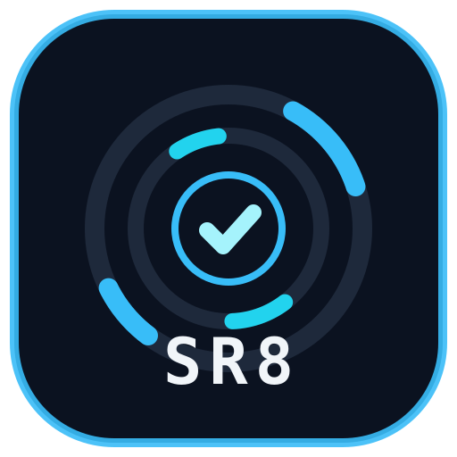

# sr8 — Sealed Tunnel trên nền frp



`sr8` biến frp thành tunnel của riêng bạn: **1 frp proxy tĩnh + Sealed Link dùng một lần, hết hạn tự hủy, không password**.

Kiến trúc:

```
visitor -> guard(:19090) -> frps vhost(:8080) -> backend local
             | HMAC(secret, "name:exp") + expiry + single-use
```

Điểm khác frp nguyên bản và PortBuddy: không tạo proxy/tunnel mới cho mỗi lần share,
không sửa TOML, không reload. Guard multiplex vô hạn link bằng path `/t/<name>/`.

## Tính năng

- **Sealed Link**: `python sealed/seal.py demo 300` ra link `/t/demo/?exp=..&seal=..`
- **Single-use + expiry**: dùng lại, sai seal, thiếu seal, hết hạn đều `403`
- **Anti-leak guard**: strip `X-Forwarded-*/Referer/Server`, rewrite `Location` nội bộ,
  fingerprint `Server: nginx`, `Referrer-Policy: no-referrer`
- **frp lõi**: `tcp/udp/http/stcp/xtcp`, LB group, healthcheck, KCP/QUIC, TLS force
- **Wrapper tốc độ**: `fast-frp.sh` (Linux) + `fast-frp.ps1` (Windows)
- **Sidecar demo**: `bore-server` cho TCP tạm không cần config
- **Deploy**: `docker-compose.yml` (`frps + Caddy + bore`) cho VPS Linux

## Nhịp update frp upstream

frp cập nhật thường xuyên (release gần nhất `v0.71.0` ngày 2026-08-14, trước đó `v0.70.1` ngày 2026-07-23).
Repo này đã verify OK với `frp v0.71.0` bằng `frps verify` + `frpc verify` và test loopback
HTTP `200` + TCP thô echo `FRP-TCP-OK` trên Windows 11. Khi upstream ra bản mới, chỉ cần đổi
image `snowdreamtech/frps:<tag>` trong `docker-compose.yml` rồi chạy lại 2 lệnh verify.

## Chạy nhanh (loopback 1 máy, không cần VPS/Docker)

```powershell
# 1. backend dummy
python -m http.server 18081 --bind 127.0.0.1
# 2. frps + frpc (dùng binary frp v0.71.0, config trong tests/)
C:\Temp\frp\frps.exe -c tests\frps-loopback.toml
C:\Temp\frp\frpc.exe -c tests\frpc-loopback.toml
# 3. guard
$env:SEAL_SECRET="loopback-test-seal-1234567890"; python sealed/guard.py
# 4. tạo link
$env:SEAL_SECRET="loopback-test-seal-1234567890"; $env:GUARD_BASE="http://127.0.0.1:19090"
python sealed/seal.py demo 300
```

Chi tiết xem `tests/README.md` và `sealed/README.md`.

## Deploy VPS (Oracle Always Free)

```bash
docker compose up -d
ss -tlnp | grep -E '7000|7835|8080|5002|2222'
```

Mở firewall: TCP `7000,5002,7835,8080,8443,2222,20000-40000`, UDP `7000,20000-40000`.
DNS: `A tunnel.example.com -> VPS_IP`, `A *.tunnel.example.com -> VPS_IP`.
Xem `FREE-HOSTS.md` cho ma trận free-host TCP thô.

## Cấu trúc

```
frps.toml            lõi frps (bind 7000, vhost 8080/8443, allowPorts 20000-40000)
frpc-examples.toml   8 mẫu: http/tcp/udp/stcp/xtcp/LB + visitor
Caddyfile            TLS wildcard -> guard/frps
docker-compose.yml   frps + Caddy + bore-server (Linux only, host network)
fast-frp.sh/.ps1     wrapper tốc độ kiểu portbuddy
sealed/              guard.py + seal.py + README (tính năng đột phá)
tests/               loopback single-machine + README
FREE-HOSTS.md        ma trận free-host + kiểm chứng TCP
```

## Bảo mật

Đổi `auth.token`, `webServer.password`, `secretKey`, `SEAL_SECRET` trước khi public.
Dashboard `127.0.0.1:7500`, xem từ xa qua `ssh -L 7500:127.0.0.1:7500 user@VPS`.
DB/SSH qua TCP thô là byte-for-byte: DB password mạnh, SSH key-only + fail2ban.

## License

MIT — xem `LICENSE`.
